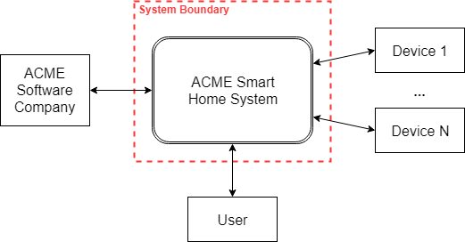
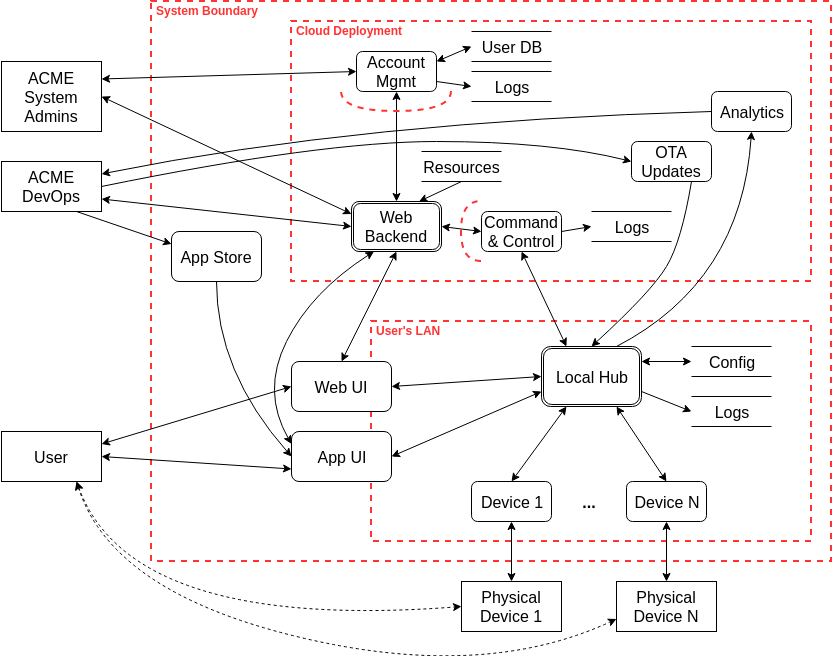
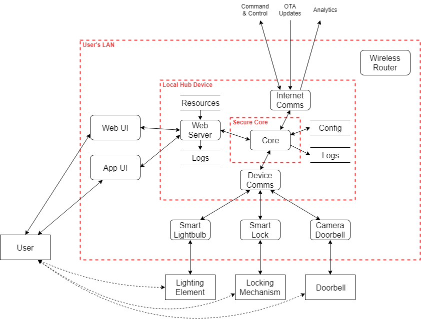

# Smart Home Threat Model <!-- omit in toc -->

## Overview <!-- omit in toc -->

This project is a partial threat model for a smart home system consisting of a front end system that
has interactions with users, some type of authentication, and interactions with at least one back
end server.
<!-- TODO: update description when I've fleshed it out. -->

This is a project for GVSU's Information Security Principles course (CIS 615). See the
[assignment](Assignment.md) for more details.

## Contents <!-- omit in toc -->

- [Threat Model](#threat-model)
  - [Data Flow Diagrams](#data-flow-diagrams)
    - [Level 0](#level-0)
    - [Level 1](#level-1)
    - [Level 2](#level-2)
  - [STRIDE Threats](#stride-threats)
    - [Spoofing](#spoofing)
    - [Tampering](#tampering)
    - [Repudiation](#repudiation)
    - [Information Disclosure](#information-disclosure)
    - [Denial of Service](#denial-of-service)
    - [Escalation of Privilege](#escalation-of-privilege)
  - [Threat Tree](#threat-tree)
  - [Risks with DREAD and FAIR](#risks-with-dread-and-fair)
- [License](#license)

# Threat Model

<!-- TODO: write basic system description -->

## Data Flow Diagrams

### Level 0

A level 0 data flow diagram provides context and shows the system at the highest possible level.
The system is represented as a single process interacting with a few external entities. Here the
ACME Smart Home System is a single process that communicates with the ACME Software Company, a user,
and N smart devices.

### Level 1

A level 1 data flow diagram shows the main processes, data stores, data flows, and trust boundaries
of the system. It is more detailed than the level 0 diagram but still abstract enough to contain the
entire system.

Here the smart home system is broken into its component parts. Primary trust boundaries are the
cloud deployment and the user's LAN. The backend is divided into several processes, but the primary
web backend is still complex enough to represent as a multi-process. The web and app UIs are
displayed crossing the LAN boundary to indicate the different modes of operation. The devices are
shown as processes as well as external entities to represent their dual cyber and physical nature.
All processes are assumed to have some resources and logs; only very important ones are shown at
this level.

### Level 2

A level 2 data flow diagram goes into greater detail for a portion of the system.

Here the LAN and local hub are examined in more detail. The hub is divided into four tasks:

1. A web server to requests from the web and app UIs
2. Internet communications to manage interactions with upstream command and control, OTA update, and
   analytics servers.
3. Device communications to manage interactions with local smart devices
4. A secure core to authenticate and isolate operations of mixed criticality

The model is populated with example smart devices to help elicit use cases, misuse cases, and
threats. The wireless router is shown to remind the analyst of its presence on the LAN. Because all
traffic is routed through it, it would be impractical to show all the connections, but it is
important to consider its presence. As with the level 1 diagram, only resources and logs relevant to
this level of abstraction are shown.

## STRIDE Threats

STRIDE is a method that can be used to elicit threats in a system. A team can use basic STRIDE,
STRIDE-per-element, or Microsoft's STRIDE-based game
[Escalation of Privilege](https://social.technet.microsoft.com/wiki/contents/articles/285.elevation-of-privilege-the-game.aspx).
This list was created with basic STRIDE, is not exhaustive, and is not in order of risk or severity.

### Spoofing

| Number | Operational Base | Identity Spoofed                    | With Respect To |
| ------ | ---------------- | ----------------------------------- | --------------- |
| S.1    | WAN              | an ACME admin or developer          | backend servers |
| S.2    | WAN              | the ACME command and control server | a local hub     |
| S.3    | WAN              | the ACME OTA update server          | a local hub     |
| S.4    | WAN              | a user                              | the web backend |
| S.5    | user's LAN       | a user                              | the local hub   |
| S.6    | user's LAN       | the local hub                       | a smart device  |
| S.7    | user's LAN       | a smart device                      | the local hub   |

### Tampering

| Number | Operational Base | Resource Tampered |
| ------ | ---------------- | ----------------- |
| T.1    | data center      | web resources     |
| T.2    | data center      | user database     |
| T.3    | local hub device | web resources     |
| T.4    | local hub device | config files      |

### Repudiation

| Number | Operational Base | Activity Repudiated                              |
| ------ | ---------------- | ------------------------------------------------ |
| R.1    | ACME LAN         | admin operations on data center resources        |
| R.2    | ACME LAN         | developer software updates and deployments       |
| R.3    | data center      | web server interactions with account management  |
| R.4    | data center      | web server interactions with command and control |
| R.5    | local hub device | external (WAN, LAN) interactions with local hub  |
| R.6    | local hub device | system interactions with secure core             |

### Information Disclosure

| Number | Operational Base | Information Disclosed  | Source of Interception                               |
| ------ | ---------------- | ---------------------- | ---------------------------------------------------- |
| I.1    | WAN              | user database          | transit between data center and ACME LAN             |
| I.2    | data center      | user database          | on disk                                              |
| I.3    | ACME LAN         | ACME admin credentials | on disk                                              |
| I.4    | user's LAN       | user credentials       | on disk                                              |
| I.5    | user's LAN       | device status          | in transit between device and local hub              |
| I.6    | WAN              | device status          | in transit between command and control and local hub |

### Denial of Service

| Number | Operational Base                   | Service Denied                   | Overloaded Resource          |
| ------ | ---------------------------------- | -------------------------------- | ---------------------------- |
| D.1    | WAN                                | user access to web backend       | network bandwidth            |
| D.2    | WAN                                | user access to web backend       | server connections           |
| D.3    | on-device                          | logging                          | disk usage                   |
| D.4    | physical proximity to WiFi         | smart device access to local hub | wireless bandwidth           |
| D.5    | physical proximity to smart device | smart->physical device control   | electro-mechanical interface |

### Escalation of Privilege

| Number | Operational Base | Privilege Gained                    | Escalation Mechanism                |
| ------ | ---------------- | ----------------------------------- | ----------------------------------- |
| E.1    | WAN              | shell on web server                 | vulnerability in web server         |
| E.2    | WAN              | admin access to data center servers | compromised ACME credentials        |
| E.3    | WAN              | user access to web backend          | compromised user credentials        |
| E.4    | user privilege   | root privilege                      | vulnerability in privileged program |
| E.5    | user privilege   | root privilege                      | insecure configuration              |
| E.6    | local hub device | access to secure core               | vulnerability in application        |

## Threat Tree

## Risks with DREAD and FAIR

# License

This project is licensed under the Creative Commons Attribution 4.0 International license. The text
is copyrighted by Kevin Kredit, but is reusable provided credit and license notice. See the license
[text](LICENSE) for more details.
