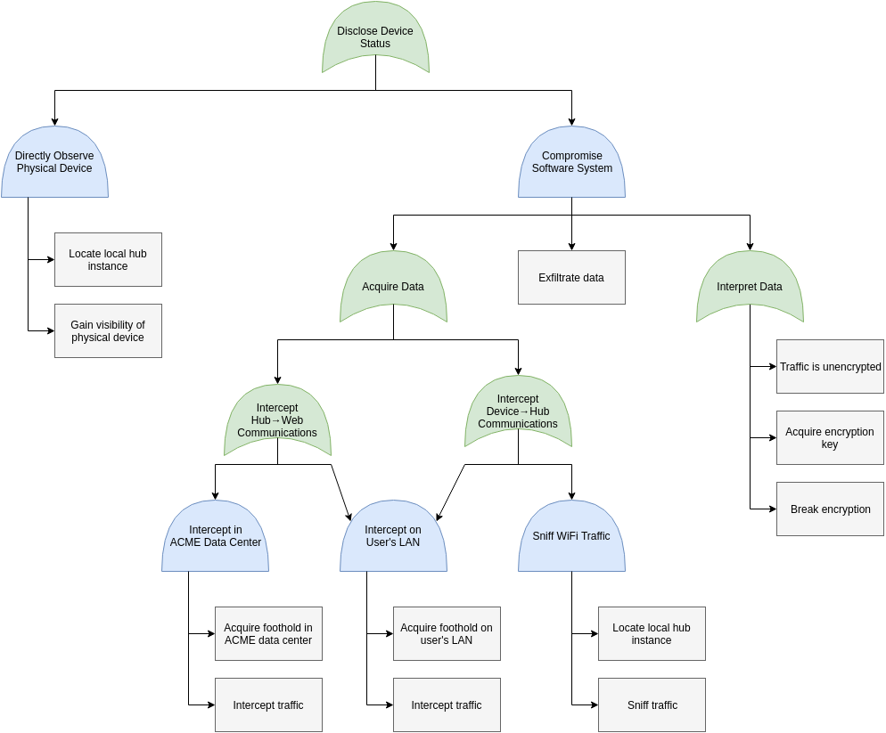

# Smart Home Threat Model <!-- omit in toc -->

## Overview <!-- omit in toc -->

This project is a partial threat model for a fictional ACME smart home system consisting of a web
and mobile UI, a cloud-deployed backend, local hub instances, and smart devices. The model consists
of level 0, 1, and 2 data flow diagrams; STRIDE threat analysis; an attack tree; and risk analysis
with DREAD and FAIR.

This is a project for GVSU's Information Security Principles course (CIS 615). See the
[assignment](Assignment.md) for more details.

## Contents <!-- omit in toc -->

- [Threat Model](#threat-model)
  - [Data Flow Diagrams](#data-flow-diagrams)
    - [Level 0](#level-0)
    - [Level 1](#level-1)
    - [Level 2](#level-2)
  - [STRIDE Threats](#stride-threats)
    - [Spoofing](#spoofing)
    - [Tampering](#tampering)
    - [Repudiation](#repudiation)
    - [Information Disclosure](#information-disclosure)
    - [Denial of Service](#denial-of-service)
    - [Escalation of Privilege](#escalation-of-privilege)
  - [Attack Tree: Confidentiality Compromise](#attack-tree-confidentiality-compromise)
  - [DREAD and FAIR](#dread-and-fair)
    - [Three Risks Analyzed with DREAD](#three-risks-analyzed-with-dread)
      - [Vulnerability 1: Geographic Discovery](#vulnerability-1-geographic-discovery)
      - [Vulnerability 2: Router Password Crack](#vulnerability-2-router-password-crack)
      - [Vulnerability 3: Device Spoofing](#vulnerability-3-device-spoofing)
    - [Two Risks Analyzed with FAIR](#two-risks-analyzed-with-fair)
      - [Vulnerability 4: Insecure MQTT Server](#vulnerability-4-insecure-mqtt-server)
      - [Vulnerability 5: Device Manipulation](#vulnerability-5-device-manipulation)
  - [Summary](#summary)
- [License](#license)

# Threat Model

## Data Flow Diagrams

### Level 0

A level 0 data flow diagram provides context and shows the system at the highest possible level.
The system is represented as a single process interacting with a few external entities. Here the
ACME Smart Home System is a single process that communicates with the ACME Software Company, a user,
and N smart devices.

### Level 1

A level 1 data flow diagram shows the main processes, data stores, data flows, and trust boundaries
of the system. It is more detailed than the level 0 diagram but still abstract enough to contain the
entire system.

Here the smart home system is broken into its component parts. Primary trust boundaries are the
cloud deployment and the user's LAN. The backend is divided into several processes, but the primary
web backend is still complex enough to represent as a multi-process. The web and app UIs are
displayed crossing the LAN boundary to indicate the different modes of operation. The devices are
shown as processes as well as external entities to represent their dual cyber and physical nature.
All processes are assumed to have some resources and logs; only very important ones are shown at
this level.

### Level 2

A level 2 data flow diagram goes into greater detail for a portion of the system.

Here the LAN and local hub are examined in more detail. The hub is divided into four processes:

1. A web server to requests from the web and app UIs
2. Internet communications to manage interactions with upstream command and control, OTA update, and
   analytics servers.
3. Device communications to manage interactions with local smart devices
4. A secure core to authenticate and isolate operations of mixed criticality

The model is populated with example smart devices to help elicit use cases, misuse cases, and
threats. The wireless router is shown to remind the analyst of its presence on the LAN. Because all
traffic is routed through it, it would be impractical to show all the connections, but it is
important to consider its presence. As with the level 1 diagram, only resources and logs relevant to
this level of abstraction are shown.

## STRIDE Threats

STRIDE is a method that can be used to elicit threats in a system. A team can use basic STRIDE,
STRIDE-per-element, or Microsoft's STRIDE-based game
[Escalation of Privilege](https://social.technet.microsoft.com/wiki/contents/articles/285.elevation-of-privilege-the-game.aspx).
This list was created with basic STRIDE, is not exhaustive, and is not in order of risk or severity.

### Spoofing

| Number | Operational Base | Identity Spoofed                    | With Respect To |
| ------ | ---------------- | ----------------------------------- | --------------- |
| S.1    | WAN              | an ACME admin or developer          | backend servers |
| S.2    | WAN              | the ACME command and control server | a local hub     |
| S.3    | WAN              | the ACME OTA update server          | a local hub     |
| S.4    | WAN              | a user                              | the web backend |
| S.5    | user's LAN       | a user                              | the local hub   |
| S.6    | user's LAN       | the local hub                       | a smart device  |
| S.7    | user's LAN       | a smart device                      | the local hub   |

### Tampering

| Number | Operational Base | Resource Tampered |
| ------ | ---------------- | ----------------- |
| T.1    | data center      | web resources     |
| T.2    | data center      | user database     |
| T.3    | local hub device | web resources     |
| T.4    | local hub device | config files      |

### Repudiation

| Number | Operational Base | Activity Repudiated                              |
| ------ | ---------------- | ------------------------------------------------ |
| R.1    | ACME LAN         | admin operations on data center resources        |
| R.2    | ACME LAN         | developer software updates and deployments       |
| R.3    | data center      | web server interactions with account management  |
| R.4    | data center      | web server interactions with command and control |
| R.5    | local hub device | external (WAN, LAN) interactions with local hub  |
| R.6    | local hub device | system interactions with secure core             |

### Information Disclosure

| Number | Operational Base                   | Information Disclosed  | Source of Interception                               |
| ------ | ---------------------------------- | ---------------------- | ---------------------------------------------------- |
| I.1    | WAN                                | user database          | transit between data center and ACME LAN             |
| I.2    | data center                        | user database          | on disk                                              |
| I.3    | ACME LAN                           | ACME admin credentials | on disk                                              |
| I.4    | user's LAN                         | user credentials       | on disk                                              |
| I.5    | WAN                                | device status          | in transit between command and control and local hub |
| I.6    | user's LAN                         | device status          | in transit between device and local hub              |
| I.7    | physical proximity to smart device | device status          | direct observation of physical device                |

### Denial of Service

| Number | Operational Base                   | Service Denied                   | Overloaded Resource          |
| ------ | ---------------------------------- | -------------------------------- | ---------------------------- |
| D.1    | WAN                                | user access to web backend       | network bandwidth            |
| D.2    | WAN                                | user access to web backend       | server connections           |
| D.3    | on-device                          | logging                          | disk usage                   |
| D.4    | physical proximity to WiFi         | smart device access to local hub | wireless bandwidth           |
| D.5    | physical proximity to smart device | smart->physical device control   | electro-mechanical interface |

### Escalation of Privilege

| Number | Operational Base | Privilege Gained                    | Escalation Mechanism                |
| ------ | ---------------- | ----------------------------------- | ----------------------------------- |
| E.1    | WAN              | shell on web server                 | vulnerability in web server         |
| E.2    | WAN              | admin access to data center servers | compromised ACME credentials        |
| E.3    | WAN              | user access to web backend          | compromised user credentials        |
| E.4    | user privilege   | root privilege                      | vulnerability in privileged program |
| E.5    | user privilege   | root privilege                      | insecure configuration              |
| E.6    | local hub device | access to secure core               | vulnerability in application        |

## Attack Tree: Confidentiality Compromise

An attack tree graphically represents the means an attacker could use to achieve an objective.

Here an attack on information confidentiality of device status is analyzed. This threat corresponds
to threats I.5, I.6, and I.7 in the STRIDE analysis.

## DREAD and FAIR

DREAD and FAIR are two methods of quantifying risk. DREAD averages the scores rated 0-10 for damage,
reproducibility, exploitability, affected users, and discoverability. FAIR, or factor analysis
of information risk, takes a more methodical approach. FAIR is a complex method that is caricatured
here.

In order to calculate risk, one must consider specific vulnerabilities that enable threats to be
realized. To build on the attack tree example, hypothetical vulnerabilities leading to a complete
device status disclosure attack chain will be analyzed.

One way of capitalizing on smart home system vulnerabilities is to read and manipulate device
status in order to enable theft. Though this example requires physical presence in order to be
executed, many remote attacks are conceivable. A complete threat model would consider those
as well.

### Three Risks Analyzed with DREAD

Damage, affected users, and discoverability are fairly clear terms. Reproducibility and
exploitability are a bit more nebulous and overlapping. Here to be reproducible means able to be
reliably triggered via an automated attack, and to be exploitable means able to be triggered by an
attacker of low skill level.

#### Vulnerability 1: Geographic Discovery

Vulnerability: conspicuous installation enables geographic discoverablity of hub instance.

Description: driving through a neighborhood, attackers can identify homes equipped with the ACME
smart home system due to visible ACME smart devices on the home exterior and window stickers
advertising the ACME security system. Because the attackers know the system is vulnerable, such
evidence that the system is installed turns from a security asset to a liability.

| Category        | Rating (0-10) | Comments                                                                |
| --------------- | ------------- | ----------------------------------------------------------------------- |
| Damage          | 0             | Lacking known vulnerabilities, is actually a feature                    |
| Reproducibility | 3             | Reliable but not automatable                                            |
| Exploitability  | 10            | No skill required                                                       |
| Affected Users  | 4             | Slightly less than half of installations externally visible             |
| Discoverability | 9             | Clearly visible for any installation with external devices or a sticker |
| **Risk**        | **5.2**       | Mitigation: maintain reputation so it's a feature, not a bug            |

#### Vulnerability 2: Router Password Crack

Vulnerability: brute forcible password on WiFi router allows access to LAN.

Description: to gain a foothold on the LAN, the simplest way is to guess the WiFi router's password.
Many users choose names of their pets, parts of their address, or simple phrases. Brute force
attacks based on contextual information could be quite successful.

| Category        | Rating (0-10) | Comments                                                                           |
| --------------- | ------------- | ---------------------------------------------------------------------------------- |
| Damage          | 9             | Even without an attack on the ACME system, it is bad to have attackers on your LAN |
| Reproducibility | 8             | Semi-reliable, fully automatable                                                   |
| Exploitability  | 8             | No skill required                                                                  |
| Affected Users  | 6             | Many users use poor passwords                                                      |
| Discoverability | 1             | No way to discover the vulnerability without running the attack                    |
| **Risk**        | **6.8**       | Mitigations: train users; display strong warning if on LAN with weak password      |

#### Vulnerability 3: Device Spoofing

Vulnerability: forced fallback to unverified smart devices allows device spoofing.

Description: one can imagine developers designing device authentication into the ACME smart home
system, and having marketing push for a fallback so that all past smart devices can be grandfathered
in to the new platform. This vulnerability is a flaw in the device setup protocol that allows
devices to force the unauthenticated device mode. It also requires the capability to device
addition without user interaction.

| Category        | Rating (0-10) | Comments                                                               |
| --------------- | ------------- | ---------------------------------------------------------------------- |
| Damage          | 2             | Without other known vulnerabilities, does not do much harm             |
| Reproducibility | 10            | Fully reliable and automatable                                         |
| Exploitability  | 5             | Requires custom but uncomplicated software to conduct the attack       |
| Affected Users  | 5             | Only affects users with insecure LANs                                  |
| Discoverability | 10            | Everywhere, because it is a feature                                    |
| **Risk**        | **6.4**       | Mitigation: require authenticated user involvement during device setup |

### Two Risks Analyzed with FAIR

Factor analysis of information risk has here been simplified into a bottom-up tree with severity
scores ranging form 0-10 in order to create a simple comparison to the DREAD scores. Regardless of
wording of the element, a higher score is a worse security outcome.

#### Vulnerability 4: Insecure MQTT Server

Vulnerability: buffer overflow in MQTT server over-exposes data.

Description: Many IoT devices and hubs communicate using MQTT. This hypothetical vulnerability is a
buffer overflow in the subscription expression parser of the hub device's MQTT server component. The
overflow allows a user to subvert ACLs and access all device data. (It is possible to achieve a
similar effect trivially if ACLs are not configured or are misconfigured.) For this example, assume
the MQTT server is written in C.

| Category | Rating (0-10) | Comments                                                         |
| -------- | ------------- | ---------------------------------------------------------------- |
| **Risk** | **4.5**       | Mitigations: secure coding practices; use a memory-safe language |

#### Vulnerability 5: Device Manipulation

Vulnerability: poorly configured hub rules allow indirect manipulation of other devices.

Description: One purpose of smart home devices is to create emergent behavior. A user could create a
rule saying that the front door should unlock 30 seconds after the garage is opened, or the security
alarm should be disabled when more than one person is home. At this point in the attack chain we
already have device information and spoofing capabilities. This vulnerability is an insecure rule
configuration that allows the state of unauthenticated (spoofable) devices to influence the behavior
of real devices.

| Category | Rating (0-10) | Comments                                                                |
| -------- | ------------- | ----------------------------------------------------------------------- |
| **Risk** | **3**         | Mitigation: disallow rules that take input from unauthenticated devices |

## Summary

This partial threat model has analyzed a fictional ACME smart home system through the use of data
flow diagrams, STRIDE analysis, attack trees, and risk analysis.

The vulnerabilities analyzed take the attacker through all stages of target acquisition, perimeter
exploitation, privilege escalation, and objective completion. While none of the vulnerabilities
were particularly severe on their own, when taken together they allow an attacker to compromise the
fundamental confidentiality and integrity of the system. In this case, the attacker would be able to
discern and affect the state of smart devices in the home, enabling a crime such as theft.

# License

This project is licensed under the Creative Commons Attribution 4.0 International license. The text
is copyrighted by Kevin Kredit, but is reusable provided credit and license notice. See the license
[text](LICENSE) for more details.
