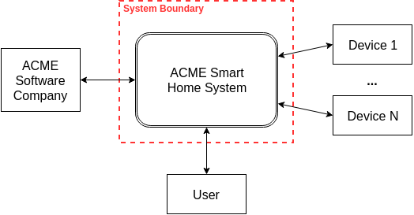
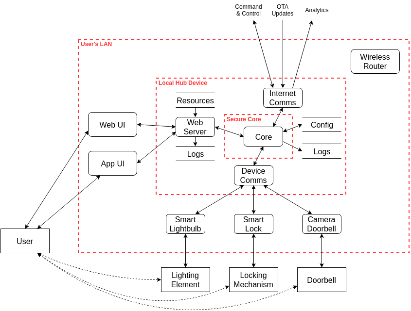

# Smart Home Threat Model

## Overview

This project is a partial threat model for a smart home system consisting of a front end system that
has interactions with users, some type of authentication, and interactions with at least one back
end server.
<!-- TODO: update description when I've fleshed it out. -->

This is a project for GVSU's Information Security Principles course (CIS 615). See the
[assignment](Assignment.md) for more details.

## Contents

- [Smart Home Threat Model](#smart-home-threat-model)
  - [Overview](#overview)
  - [Contents](#contents)
- [Threat Model](#threat-model)
  - [Data Flow Diagrams](#data-flow-diagrams)
    - [Level 0](#level-0)
    - [Level 1](#level-1)
    - [Level 2](#level-2)
  - [STRIDE Threats](#stride-threats)
  - [Threat Tree](#threat-tree)
  - [Risks with DREAD and FAIR](#risks-with-dread-and-fair)
- [License](#license)

# Threat Model

<!-- TODO: write basic system description -->

## Data Flow Diagrams

### Level 0

A level 0 data flow diagram provides context and shows the system at the highest possible level.
The system is represented as a single process interacting with a few external entities. Here the
ACME Smart Home System is a single process that communicates with the ACME Software Company, a user,
and N smart devices.

### Level 1

A level 1 data flow diagram shows the main processes, data stores, data flows, and trust boundaries
of the system. It is more detailed than the level 0 diagram but still abstract enough to contain the
entire system.

Here the smart home system is broken into its component parts. Primary trust boundaries are the
cloud deployment and the user's LAN. The backend is divided into several processes, but the primary
web backend is still complex enough to represent as a multi-process. The web and app UIs are
displayed crossing the LAN boundary to indicate the different modes of operation. The devices are
shown as processes as well as external entities to represent their dual cyber and physical nature.
All processes are assumed to have some resources and logs; only very important ones are shown at
this level.

### Level 2

A level 2 data flow diagram goes into greater detail for a portion of the system.

Here the LAN and local hub are examined in more detail. The hub is divided into four tasks:

1. A web server to requests from the web and app UIs
2. Internet communications to manage interactions with upstream command and control, OTA update, and
   analytics servers.
3. Device communications to manage interactions with local smart devices
4. A secure core to authenticate and isolate operations of mixed criticality

The model is populated with example smart devices to help elicit use cases, misuse cases, and
threats. The wireless router is shown to remind the analyst of its presence on the LAN. Because all
traffic is routed through it, it would be impractical to show all the connections, but it is
important to consider its presence. As with the level 1 diagram, only resources and logs relevant to
this level of abstraction are shown.

## STRIDE Threats

## Threat Tree

## Risks with DREAD and FAIR

# License

This project is licensed under the Creative Commons Attribution 4.0 International license. The text
is copyrighted by Kevin Kredit, but is reusable provided credit and license notice. See the license
[text](LICENSE) for more details.
